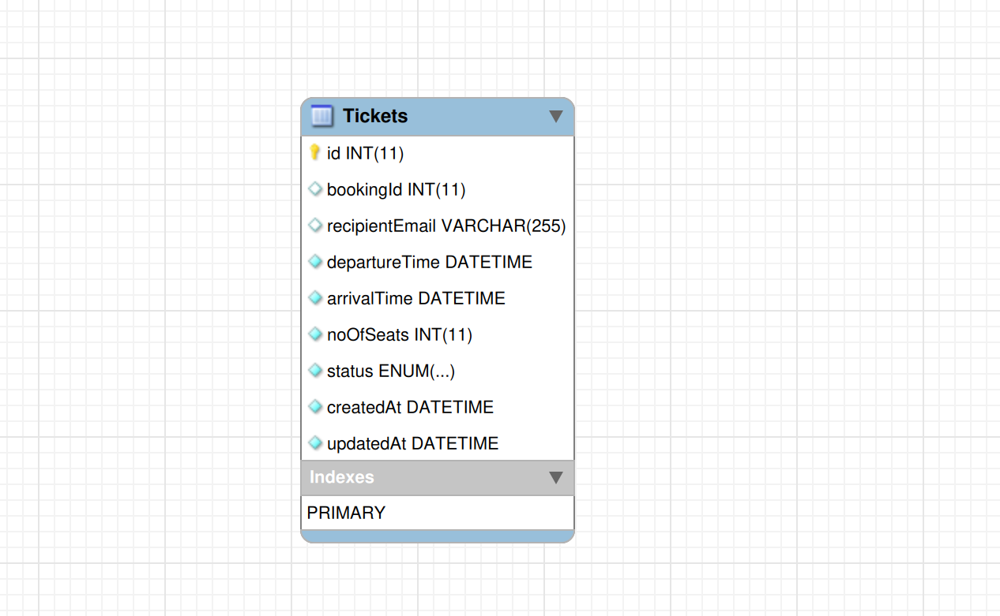

# Aviation Microservices API

## Live
<!-- The deployed application can be fetched at [Aviation-Microservices-API]( https://documenter.getpostman.com/view/31979006/2sA3kUG2Ez#5ce53c23-fd76-4a0a-83e3-6d5d77b94995). -->
Please refer to the Postman Docs to understand the APIs and try out [Postman Collection](https://documenter.getpostman.com/view/31979006/2sA3kUG2Ez#5ce53c23-fd76-4a0a-83e3-6d5d77b94995)

## Description
This is an Airline managemnet and flight booking system based on microservices architecture. It has 4 microservices:
 - [Flight Service](https://github.com/piyush932/Flight-Service-API)
 - [Flight Booking Service](https://github.com/piyush932/Flight-Booking-Service)
 - [Flight API Gateway](https://github.com/piyush932/Flights-API-Gateway)
 - [Flight Notification Service](https://github.com/piyush932/Flights-Notification-Service)

## Non Functional Requirements
Non functional Requirements
1.  We can expect more flight searching than bookings
2.  The system needs to be reliable in terms of booking
3.  Expect that we will be having 100k total users.
4.  100k bookings might come up in quarter
5.  In one day you might be getting 100 bookings
6.  System should make sure that we don?t change the prices where the
    booking payment is going on.
7.  System should be able to auto scale itself atleast for 3x more traffic.

## Design


## ER Diagram

### For Flights DB


### For Notification DB


## Microservices Overview

### 1. Flight Service
The Flight Service acts as the core component, encompassing multiple models including airplane, airport, city, flight, and seat models. This microservice handles all essential functionalities related to flights, airports, and cities. It enables efficient scheduling and allocation of airplanes, manages flight routes and durations, and facilitates seat reservations for passengers.

### 2. Flight Booking Service
The Flight Booking Service focuses on the booking process and includes the booking model. It incorporates cron jobs that run every 30 minutes to automatically check for pending or initiated bookings with expired payment times, automatically canceling such bookings if necessary. Additionally, this microservice utilizes RabbitMQ to send booking information to a queue for further processing by the Flight Notification Service.

### 3. Flight API Gateway Service
The Flight API Gateway Service provides a centralized entry point for accessing the flight service's functionalities. It incorporates user and role models for managing user information and permissions. Key features include:
- Rate limiting to control API usage
- Reverse proxy for efficient routing
- JWT (JSON Web Tokens) for user authentication
- Authorization system to ensure access control based on user roles

### 4. Flight Notification Service
The Flight Notification Service is responsible for sending notifications to users regarding their flight bookings. Once a booking is successfully processed and confirmed, the Flight Booking Service sends the relevant information to a queue. The Flight Notification Service then consumes the messages from the queue and uses Node Mailer to send emails to users, providing details about their successful bookings.

This is a base node js project template, which anyone can use as it has been prepared, by keeping some of the most important code principles and project management recommendations. Feel free to change anything.

## Tech Stack
- **Node Js**
- **Express Js**
- **mySQL**
- **Sequelize**
- **RabbitMQ**

## Flight Service

## Description

The flight service is a backend project that I have created and implemented micrservices architecture, it is a comprehensive system that manages various aspects of a flight service. 

This Service has several models airplane, airport, city, flight, and seat models for the efficient and organized operation of the flight service.

- The **airplane** model includes essential information such as the **airplane's model Number**, **seating capacity**.

- The **airport** model contains information about each airport, such as its **name**, **location**, **City code**, **address**. This model enables efficient handling of airport-related data like flight scheduling, arrivals, and departures.

- The **city** model represents the cities or locations connected by the flight service. It stores information about each **city name**.

- The **flight** model serves as the core entity within the system, capturing details about individual flights. It contains information such as the **flight number**, **airplaneId**, **departureAirportId** and **arrivalAirportId**, scheduled **departure** and **arrival times**, **price**, **totalSeats** and **boardingGate** assigned to the flight.

- The **seat** model represents the seating arrangements within each airplane. It includes information about **airplaneId**, **row**, **col**, **seatType** (e.g., economy, business, first class). It enables efficient allocation of seats during the booking process.

By integrating these models within our flight service backend project, we have established a robust system that enables effective management of airplanes, airports, cities, flights, and seats.


## API Reference

#### Airplane endpoint

```http
  /api/v1/airplanes
```

| Parameter | Method   | Body | Description                          |
| :-------- | :------- |:------- |:-------------------------         |
| `/` | `GET` |         |Get all Airplanes     |
| `/{id}` | `GET` |         |Get Airplane by ID     |
| `/` | `POST` | `modelNumber`, `capacity`       |Create New Airplanes     |
| `/{id}` | `DELETE` |         |Delete Airplane by ID     |
| `/{id}` | `PATCH` |  `capacity`       |Update Airplane     |

#### City endpoint

```http
  /api/v1/cities
```

| Parameter | Method   | Body | Description                          |
| :-------- | :------- |:------- |:-------------------------         |
| `/` | `GET` |         |Get all Cities     |
| `/` | `POST` | `name`       |Create New City     |
| `/{id}` | `DELETE` |         |Delete City by ID     |
| `/{id}` | `PATCH` |  `name`       |Update Airplane     |

#### Airport endpoint

```http
  /api/v1/airports
```

| Parameter | Method   | Body | Description                          |
| :-------- | :------- |:------- |:-------------------------         |
| `/` | `GET` |         |Get all Airports     |
| `/{id}` | `GET` |         |Get Airport by ID     |
| `/` | `POST` | `name`, `cityId`, `code`       |Create New Airport     |
| `/{id}` | `DELETE` |         |Delete Airport by ID     |
| `/{id}` | `PATCH` |  `name`, `cityId`, `code` (Min one field required)      |Update Airplane     |


#### Flight endpoint

```http
  /api/v1/flights
```

| Parameter | Method   | Body | Description                          |
| :-------- | :------- |:------- |:-------------------------         |
| `/*[?trip=MUM-DEL]` | `GET` |         |Get all Flights     |
| `/` | `POST` | `flightNumber`, `airplaneId`, `departureAirportId`, `arrivalAirportId`, `arrivalTime`, `departureTime`, `price`, `totalSeats`, `boardingGate(optional)`       |Create New City     |
| `/{id}` | `DELETE` |         |Delete Flights by ID     |
| `/{id}/seats` | `PATCH` |  `seats`, `*[dec]`       |Update Seats     |


**Note**
1. `[ ]` -> Inside this is Optional
2. if Dec will not be given in the parameter it will decrease the seat by default. if 
given dec = false it will increase the seats.

3. By Default `\` will fetch all the flights.

Query parameter 

- `trips` -> `MUM-DEL`
- `price` -> `1200-7000` or `2000`
- `travellers` -> `2`
- `tripDate` -> `02-12-23`
- `sort` -> `departureTime_ASC, price_DESC`

### Setup the project

 - Download this template from github and open it in your favourite text editor. 
 - Go inside the folder path and execute the following command:
  ```
  npm install
  ```
 - In the root directory create a `.env` file and add the following env variables
    ```
        PORT=<port number of your choice>
    ```
    ex: 
    ```
        PORT=3000
    ```
 - go inside the `src` folder and execute the following command:
    ```
      npx sequelize init
    ```
 - By executing the above command you will get migrations and seeders folder along with a config.json inside the config folder. 
 - If you're setting up your development environment, then write the username of your db, password of your db and in dialect mention whatever db you are using for ex: mysql, mariadb etc
 - If you're setting up test or prod environment, make sure you also replace the host with the hosted db url.

 - To run the server execute
 ```
 npm run dev
 ```